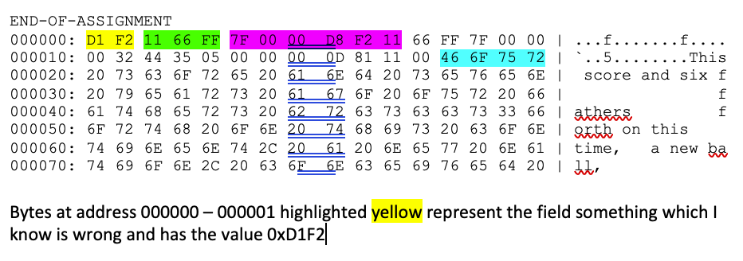

# Byte Data Transformation 📝

## Description🤗

This assignment involves reviewing a provided header file (`assignment2.h`), allocating and populating a `personalInfo` structure, and transforming byte data into block data. The assignment also includes the use of several pre-implemented functions provided in `assignment2.o`.

## Getting Started🙌

### Prerequisites

- **C Compiler (GCC)**
- **Make**

### Files Provided🦸‍♂️

- `assignment2.h`: Header file containing `#define` statements for different computer languages, the `personalInfo` structure, and function prototypes.
- `assignment2.o`: Object file containing the implementations of the required functions.

### Project Steps🏋️

#### Step 1: Review the Header File

- `#define` statements represent different computer languages.
- `personalInfo` structure contains fields to store personal information.
- `#define BLOCK_SIZE 256` sets the buffer size for transforming byte data into block data.
- Four function prototypes provided (implemented in `assignment2.o`).

#### Step 2: Makefile

- Edit the Makefile to enter your FIRST and LAST name in the variables `FIRSTNAME` and `LASTNAME`.
- Use `malloc` and `free` for dynamic memory allocation.

#### Step 3: Allocating and Populating `personalInfo`

- Allocate memory for `personalInfo` structure using `malloc`.
- Populate the structure fields:
  - `firstName` and `lastName` from the first and second command line arguments.
  - `studentID` with your student ID.
  - `level` (grade level) appropriately.
  - `languages` field with at least three languages (Java, C++, assembler, C).
  - Copy the third command line parameter to the `message` field (ensure message length).

#### Step 4: Writing Personal Information

- Call `writePersonalInfo` function to write the populated `personalInfo` structure.
- Check the return value; it should be `0` if it succeeds.

#### Step 5: Handling C Strings

- Call `getNext` function to get a series of C strings.
- Allocate a buffer of size `BLOCK_SIZE` using `malloc`.
- Copy the contents of each string into the buffer using `memcpy`.
- Commit the buffer by calling `commitBlock` with the buffer pointer.
- Continue until `getNext` returns `NULL`.

#### Step 6: Final Step

- Call the `checkIt` function.
- Exit `main` returning the value returned from `checkIt`.

#### Step 7: Hexdump Analysis

- If `checkIt` runs correctly, it will display some binary data as a hexdump.
- Describe each element in the hexdump:
- 

 

### Compilation and Execution🐢

1. **Clone the Repository:**

    ```bash
    git clone <repository_url>
    cd <repository_directory>
    ```

2. **Edit Makefile:**

    Edit `Makefile` to include your first and last name.

    ```makefile
    FIRSTNAME = YourFirstName
    LASTNAME = YourLastName
    ```

3. **Compile the Project:**

    ```bash
    make
    ```

4. **Run the Program:**

    ```bash
    ./lastname_firstname_HW1_main <firstName> <lastName> <message>
    ```


## Sample Output:🎮

This output is just what is printed from `checkIt` You can also print out the structure and information
prior to calling `checkIt`.
(Some of the data below has been altered, so your output will be different)

```
------------------------------------ CHECK ------------------------------------
Running the check for Robert Bierman
Name check is 0 by 0
Student ID: 900000000, Grade Level: Instructor
Languages: FFFFFF
Message:
There will be a message printed here 

The Check Succeded (0, 0)

END-OF-ASSIGNMENT
000000: D1 F2 11 66 FF 7F 00 00  D8 F2 11 66 FF 7F 00 00 | ...f.......f....
000010: 00 32 44 35 05 00 00 00  0D 81 11 00 46 6F 75 72 | `..5........This
000020: 20 73 63 6F 72 65 20 61  6E 64 20 73 65 76 65 6E |  score and six f
000030: 20 79 65 61 72 73 20 61  67 6F 20 6F 75 72 20 66 |                f
000040: 61 74 68 65 72 73 20 62  72 63 73 63 63 73 33 66 | athers         f
000050: 6F 72 74 68 20 6F 6E 20  74 68 69 73 20 63 6F 6E | orth on this    
000060: 74 69 6E 65 6E 74 2C 20  61 20 6E 65 77 20 6E 61 | time,   a new ba
000070: 74 69 6F 6E 2C 20 63 6F  6E 63 65 69 76 65 64 20 | ll,             
```
## License📜

This project is licensed under the MIT License - see the [LICENSE](https://choosealicense.com/licenses/mit/) file for details.

## Credits🔥

- [Juan Estrada](https://github.com/jjestrada2) - Developer of this project.

## Contact🦻

For support or inquiries, please contact [Juan Estrada](mailto:juan5801331@gmail.com).

